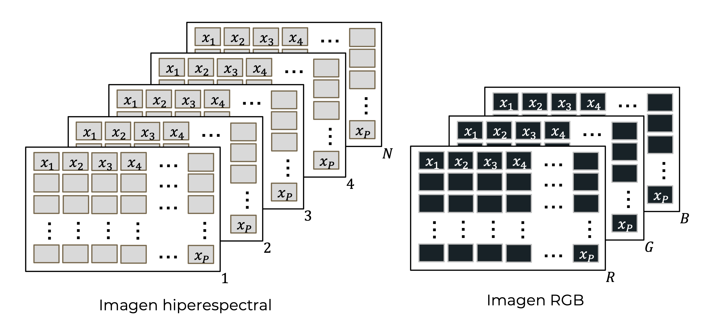
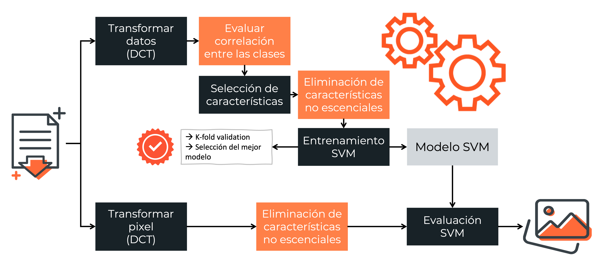
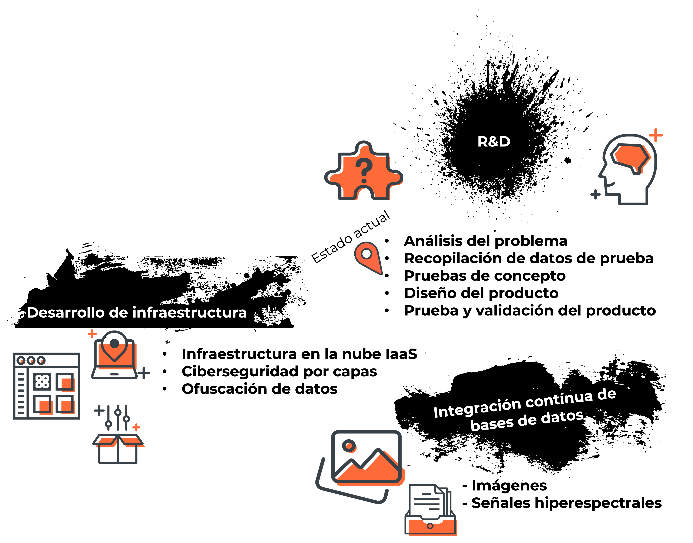

# BEDU_PrototypeDay
# Clasificación de Píxeles en Imágenes Hiperespectrales: Revelando Elementos

## Resumen

Este proyecto utiliza técnicas avanzadas de clasificación de píxeles en imágenes hiperespectrales para identificar de manera precisa y eficiente los elementos contenidos en las imágenes, proporcionando valiosos insights sobre la composición de la escena capturada. Su versatilidad lo posiciona como una base sólida para futuras aplicaciones, incluida la identificación de daños causados por catástrofes naturales.

Adicionalmente, el proyecto cuenta con un tablero en la siguiente dirección: [Tablero shiny versión desktop](https://ns24sk-beatriz0paulina.shinyapps.io/Clasificacion_hiper/) (el tablero debe visualizarse en equipos desktop).

## Motivación

* El huracán OTIS toca tierra sobre las costas de Acapulco, Guerrero, el 25 de octubre de 2023 en categoría 5 (escala Saffir-Simpson).
* El programa Copernicus de la Unión Europea da respuesta del estado situacional hasta el 5 de noviembre (una semana y media después).
* El análisis sólo incluye un mapa etiquetado rápidamente para mostrar a grandes rasgos los daños ocasionados y un tamaño estimado de área afectada. 

## Definición del Problema

En situaciones críticas como el impacto del huracán OTIS, la velocidad de respuesta es esencial para minimizar los efectos devastadores. Actualmente, el proceso de evaluación de daños se ve obstaculizado por la falta de herramientas eficientes. Con el huracán OTIS como ejemplo, las respuestas disponibles a través del programa Copernicus de la Unión Europea demoraron una semana y media en proporcionar un panorama limitado.

Para abordar esta urgencia, surge la necesidad de un sistema innovador capaz de identificar de manera ágil y precisa los daños en infraestructura y recursos naturales mediante el análisis de imágenes aéreas. Este sistema no solo agilizará la evaluación, sino que permitirá una intervención inmediata en el estado de emergencia, marcando la diferencia entre la recuperación eficiente y la prolongación de los efectos devastadores. La clave radica en la capacidad de proporcionar información detallada en un tiempo mínimo, estableciendo así un puente crucial entre la detección temprana y la acción rápida ante desastres naturales.

## Alcances del Proyecto

Este documento se centra en destacar la prueba de concepto alcanzada hasta el momento, enfocándose en la aplicación inicial de clasificación de píxeles hiperespectrales en imágenes urbanas. Esta fase específica del proyecto ha logrado con éxito la identificación y etiquetado de elementos cruciales como árboles, asfalto, tierra, agua y tejados, satisfaciendo los objetivos del proyecto:

* Implementación de un método de selección de características que permita reducir la cantidad de información que se proporciona a una Máquina de Vectores de Soporte (SVM) para un entrenamiento y etiquetado veloz.
* La selección de características debe proporcionar flexibilidad en la cantidad y diversidad de clases a evaluar.
* La clasificación debe ser exacta independientemente de la cantidad de clases seleccionadas.

Es importante resaltar que, aunque la prueba de concepto se ha centrado en la clasificación de elementos urbanos, representa la fase inicial de un proyecto más amplio. Este hito en investigación y desarrollo (R&D) sienta las bases para futuras aplicaciones, especialmente la identificación de infraestructura dañada en situaciones de emergencia. La versatilidad de la tecnología desarrollada abre la puerta a futuras expansiones, permitiendo una contribución significativa en la gestión eficiente de desastres naturales y la evaluación de impactos en la infraestructura.

## Logros de la Prueba de Concepto

1. **Etiquetado Multiclase:**
   La prueba de concepto ha logrado un etiquetado multiclase de las imágenes, proporcionando una notable versatilidad al permitir la selección de elementos específicos a buscar en las escenas. Esta capacidad es crucial para adaptarse a diversas situaciones y facilita la identificación precisa de elementos clave en entornos complejos.

2. **Clasificación Eficiente con Características Reducidas:**
   Se ha implementado una metodología de clasificación que utiliza características reducidas, lo que ha resultado en un proceso de entrenamiento y etiquetado más rápido. Esta eficiencia contribuye directamente a una mayor velocidad de respuesta, especialmente en la evaluación de grandes volúmenes de datos. La capacidad de procesar rápidamente la información es esencial en escenarios de desastres donde el tiempo es un recurso crítico.

3. **Alta Precisión en la Clasificación:**
   Los resultados obtenidos demuestran una precisión notoria en la clasificación de píxeles, con porcentajes de exactitud que oscilan desde el 90.38% hasta el impresionante 99.64%. Esta precisión varía según la cantidad de clases solicitadas, subrayando la capacidad del sistema para proporcionar resultados confiables y detallados en diversas configuraciones.

Estos logros consolidan la viabilidad y eficacia de la prueba de concepto, marcando un hito significativo en el desarrollo de un sistema capaz de abordar con éxito la identificación y evaluación de elementos cruciales en imágenes aéreas.

## Descripción Técnica

La prueba de concepto destaca una innovadora metodología de identificación visual que utiliza técnicas avanzadas de etiquetado multiclase, permitiendo una selección versátil de elementos en imágenes urbanas. Este enfoque técnico pone de relieve la capacidad del sistema para adaptarse a diversas escenas y mejorar la eficiencia en la identificación de elementos clave.

Esta descripción inicia con la definición de una imagen hiperespectral. Este tipo de imagen contiene las señales de reflectancia recabadas por un espectrómetro. Las señales de los objetos capturados en la imagen proporcionan información acerca de su composición. En palabras simples, la señal hiperespectral permite conocer si en un pixel se encuentra una planta, tierra, agua o un edificio, por ejemplo. La diferencia entre la estructura de estas imágenes y aquellas que utilizamos para inmortalizar nuestros recuerdos con el celular se muestra en la siguiente figura:

Como se aprecia, las imágenes hiperespectrales proporcionan mayor información relacionada a los objetos presentes en una escena.

La prueba de concepto se sumerge en la eficiencia de la clasificación hiperespectral, destacando el uso de características reducidas para un entrenamiento y etiquetado más rápidos, resaltando la ingeniería detrás de un sistema que logra una velocidad de respuesta excepcional al procesar grandes volúmenes de datos, contribuyendo significativamente a la agilidad en la evaluación de imágenes aéreas.

### Flujo del Proceso
El proceso de la prueba de concepto se muestra a grandes rasgos en el flujo del proceso mostrado a continuación:

Se desarrollaron documentos en formato markdown para seguir este proceso:

1. [Lectura de los datasets](./docs/1_read_datasets.md)
2. [Limpieza de los datos](./docs/2_clean_datasets.md). Se realiza considerando el análisis de correlación cruzada.

    2.1. [Correlacion cruzada de  las clases](./docs/correlacion_cruzada.md)

3. [Transformar datos a DCT](./docs/3_save_features_dct.md)
4. [Selección de datos para entrenamiento y prueba](./docs/4_get_indices_kfold.md)
5. [Separación de los datos](./docs/5_divide_train_and_test.md)
6. Evaluar correlación entre clases y selección de características

    6.1. [Clases de cada dataset](./docs/6_1_crop_features.md)

	6.2. [Todas las clases disponibles](./docs/6_2_crop_features_custom.md)

7. [Entrenamiento y prueba de la SVM](./src/classification/) (enlace a los scripts de entrenamiento)
8. Visualización de resultados

	8.1. Resultados de clasificación por dataset

	* [Resultados numéricos](./docs/classification_results.md)

	* [Resultados visuales](./docs/classification_results_visual.md)

	8.2. [Resultados de clasificación con todas las clases disponibles](./docs/classification_results_binded.md)

## Próximos Pasos

Con la exitosa prueba de concepto como base, el próximo paso crítico implica concluir el proceso de investigación y desarrollo para obtener una validación completa del producto. Este paso garantizará la robustez y eficacia del sistema antes de avanzar a la siguiente fase.

Posteriormente, se enfocará en el desarrollo de la infraestructura en la nube, estableciendo una base tecnológica sólida para el sistema. Esta infraestructura proporcionará la escalabilidad necesaria y facilitará la gestión eficiente de grandes conjuntos de datos, esencial para la aplicación práctica del sistema en situaciones de desastre.

Simultáneamente, se iniciará la implementación de la integración continua de datos, asegurando la actualización constante y automática de la información. Este enfoque permitirá mantener la relevancia y precisión del sistema en una eficiente velocidad de respuesta, garantizando su capacidad para adaptarse a entornos dinámicos y emergencias en curso.

Estos pasos se pueden visualizar en la siguiente infografía:

## Integrantes

El proyecto fue realizado por el equipo 5 del programa **Data scientist de Becas Santander | Talento Digital para el Futuro | Bedu 2023**.
El equipo se conforma de la siguiente manera:

* Beatriz Paulina García Salgado
* Rodrigo Alejandro Aguilar Rosel
* David Gómez Torres